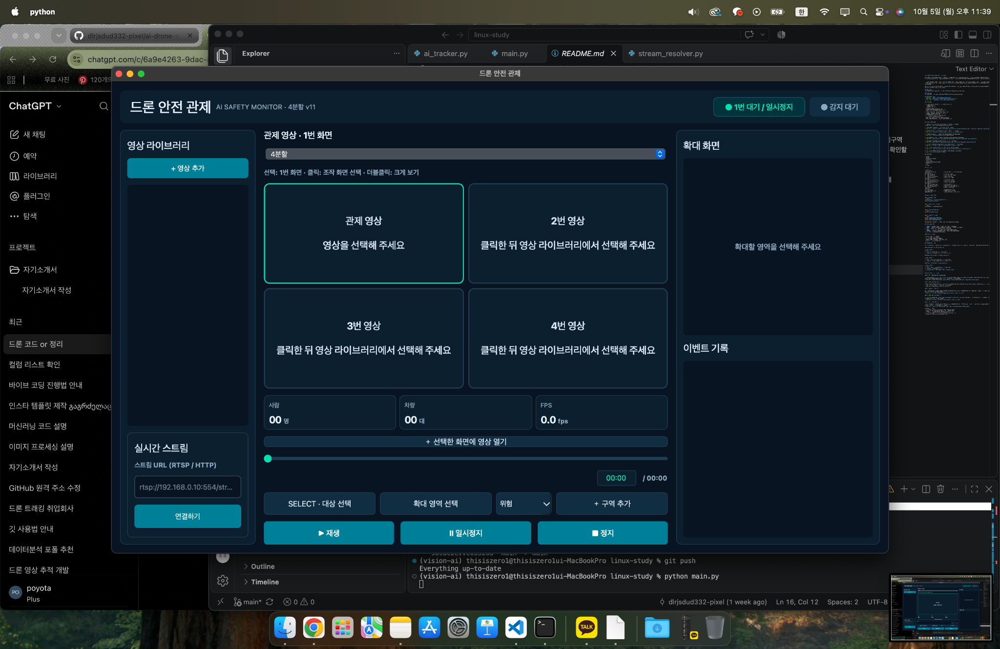

# AI 기반 실시간 드론 안전 관제 시스템

Python과 YOLO를 활용해 영상 속 사람과 차량을 탐지하고, 안전 위험을 확인하는 데스크톱 관제 프로젝트입니다. 초기 OpenCV 프로그램에서 구현한 탐지·추적·보호구 검사·넘어짐 감지 기능을 바탕으로, PySide6 UI와 영상 처리 모듈을 구성했습니다.

관제자는 최대 네 개의 영상을 함께 보면서 조작할 화면을 선택할 수 있습니다. 선택한 영상의 재생 위치를 이동하고, 특정 대상이나 영역을 확대하거나, 여러 다각형 구역에 주의·경고·위험 등급을 지정할 수 있습니다. 감지된 안전 이벤트는 화면과 CSV에 기록됩니다.

현재는 로컬 영상과 YouTube 실시간 영상을 이용해 기능을 확인했습니다. 실제 DJI Mavic 3 Classic의 실시간 영상 연동은 향후 개발 목표입니다.

## 실행 화면



왼쪽에는 영상 라이브러리와 스트림 연결, 가운데에는 선택 가능한 관제 화면과 재생 도구, 오른쪽에는 확대 화면과 이벤트 기록을 배치했습니다. 위 이미지는 4분할 화면의 초기 배치입니다.

## 주요 기능

| 기능 | 설명 |
|---|---|
| 화면 분할 | 1화면·2분할·4분할 전환 |
| 조작 화면 선택 | 영상 클릭으로 조작할 화면 선택, 테두리로 선택 상태 표시 |
| 크게 보기 | 조작 모드가 꺼진 상태에서 더블클릭하면 해당 영상만 크게 표시 |
| 영상 라이브러리 | 로컬 영상 추가 및 선택한 화면으로 불러오기 |
| 재생 제어 | 선택한 영상의 재생·일시정지·정지 |
| 시간 이동 | 로컬 영상의 슬라이더 조작 또는 `분:초` 직접 입력 |
| 객체 탐지·추적 | 사람·자동차·오토바이·버스·트럭 탐지와 추적 ID 표시 |
| 대상 확대 | 감지된 대상을 클릭해 오른쪽 확대 화면에서 확인 |
| 영역 확대 | 마우스로 드래그한 영역 확대 |
| 확대 화면 자동 맞춤 | 선택 영역과 주변 영상을 확대칸 비율에 맞춰 표시, 대상 비율 유지 |
| 다각형 구역 | 세 개 이상의 점으로 여러 구역 생성, 꼭짓점 이동·선택 구역 삭제 |
| 구역 등급 | 주의·경고·위험을 색상과 반투명 영역으로 구분 |
| 구역 진입 감지 | 사람 박스의 하단 중앙을 기준으로 다각형 내부 진입 판정 |
| 보호구 검사 | 안전모·안전조끼 미착용 감지 |
| 넘어짐 의심 감지 | 자세 추정 모델을 이용한 넘어짐 의심 판단 |
| 상태 표시 | 선택 영상의 사람 수·차량 수·AI 처리 FPS, 재생 상태 및 안전 등급 표시 |
| 이벤트 기록 | 감지 시간·추적 ID 등을 화면 이벤트 목록과 CSV에 저장 |

### 화면별 지원 범위

| 기능 | 1번 화면 | 2~4번 화면 |
|---|:---:|:---:|
| 로컬 영상 재생·시간 이동 | 지원 | 지원 |
| 사람·차량 탐지 및 대상 선택 | 지원 | 지원 |
| 대상·영역 확대 | 지원 | 지원 |
| 여러 다각형 구역 및 진입 기록 | 지원 | 지원 |
| 실시간 스트림 연결 | 지원 | 미지원 |
| 보호구 미착용·넘어짐 의심 감지 | 지원 | 미지원 |

하단 **사람 / 차량 / FPS**는 선택한 영상의 값입니다. 사람·차량 수는 현재 탐지 결과의 개수이며 누적 출입 인원이나 통행량이 아닙니다. FPS는 AI 처리 속도 지표로, 원본 영상의 프레임 속도와 다를 수 있습니다. 오른쪽 이벤트 목록에는 여러 화면의 구역 진입과 1번 화면의 보호구·넘어짐 이벤트가 모입니다.

## 사용 기술

- **Python / PySide6**: 데스크톱 UI, 신호·슬롯, 백그라운드 작업
- **OpenCV / NumPy**: 영상 읽기, 프레임 처리, 확대 영역 계산
- **Ultralytics YOLO11 / ByteTrack**: 객체 탐지와 추적 ID 관리
- **PyTorch / Apple MPS**: Apple Silicon GPU에서 모델 추론
- **YOLO11 Pose**: 사람의 자세 분석
- **Custom PPE Model**: 안전모·안전조끼 미착용 검사
- **yt-dlp**: YouTube 영상의 재생 주소 추출
- **CSV / Matplotlib**: 이벤트 저장과 별도 통계 보고서

## 모델 구성

| 모델 파일 | 용도 |
|---|---|
| `models/yolo11s.pt` | 사람·차량 탐지 및 추적 |
| `models/yolo11n-pose.pt` | 넘어짐 의심 판단용 자세 추정 |
| `models/ppe_best.pt` | 안전모·안전조끼 착용 검사 |
| `models/yolo11n.pt` | 기존 경량 객체 탐지 실험용 모델 |

PPE 모델 클래스는 `Hardhat`, `NO-Hardhat`, `NO-Safety Vest`, `Person`, `Safety Vest`입니다. 미착용 기록은 `NO_HARDHAT`, `NO_SAFETY_VEST`로 저장합니다.

## 파일 구성

프로젝트 폴더의 주요 파일은 다음과 같습니다.

```text
linux-study/
├── main.py                     # 현재 UI 실행 진입점 및 화면 제어
├── ai_tracker.py               # 사람·차량 탐지와 추적
├── ai_worker.py                # 1번 화면 AI 분석 작업
├── ppe_detector.py             # 보호구 미착용 검사
├── fall_detector.py            # 넘어짐 의심 감지
├── stream_resolver.py          # YouTube 재생 주소 추출
├── stream_capture.py           # 백그라운드 스트림 읽기
├── drone_tracker.py            # 초기 OpenCV 버전, 별도 실행용
├── models/
│   ├── yolo11s.pt
│   ├── yolo11n.pt
│   ├── yolo11n-pose.pt
│   └── ppe_best.pt
├── data/
│   ├── ui_zone_events.csv      # 현재 UI의 다각형 구역 진입 기록
│   ├── danger_events.csv       # 초기 OpenCV 버전의 위험구역 기록
│   ├── fall_events.csv         # 넘어짐 의심 기록
│   └── ppe_events.csv          # 보호구 미착용 기록
├── reports/
│   ├── danger_report.py
│   ├── fall_report.py
│   └── ppe_report.py
├── videos/                     # 사용자가 준비하는 테스트 영상
├── docs/
│   └── images/
│       └── main_screen.png     # README 실행 화면
├── requirements.txt
└── README.md
```

현재 UI는 `main.py`에서 각 분석 모듈을 불러옵니다. `drone_tracker.py`를 동시에 실행하거나 직접 불러오는 구조는 아니며, 초기 버전의 구현과 실험 이력을 보관하는 파일입니다.

## 설치 및 실행

### 1. 가상환경 준비

새 환경을 만들 때:

```bash
conda create -n vision-ai python=3.11 -y
conda activate vision-ai
```

이미 환경이 있으면 `conda activate vision-ai`만 실행합니다. 프로젝트 최상위 폴더에서 아래 명령을 실행합니다.

### 2. 라이브러리 설치

```bash
python -m pip install -r requirements.txt
python -m pip install PySide6
```

필요한 주요 패키지는 `ultralytics`, `opencv-python`, `numpy`, `torch`, `PySide6`, `yt-dlp`, `matplotlib`입니다. `requirements.txt`에 PySide6가 포함되어 있다면 두 번째 명령은 생략할 수 있습니다.

현재 GPU 설정은 macOS Apple Silicon의 `mps` 기준입니다. Windows·Linux 또는 CPU 실행은 분석 모듈의 장치 설정을 환경에 맞게 수정해야 합니다. 각 모델 파일을 `models/`에 준비합니다.

### 3. UI 실행

```bash
python main.py
```

UI가 열리면 **+ 영상 추가**로 로컬 영상을 등록합니다. 영상 칸을 클릭한 뒤 라이브러리에서 파일을 선택하면 해당 칸에 불러옵니다. **선택한 화면에 영상 열기** 버튼으로도 파일을 열 수 있습니다.

실시간 연결은 왼쪽 입력칸에 지원되는 스트림 주소 또는 YouTube 주소를 입력하고 **연결하기**를 누릅니다. 실시간 영상은 1번 화면에서 열리며 시간 이동 입력은 비활성화됩니다. 영상 제공 상태와 네트워크에 따라 연결이 실패하거나 끊길 수 있습니다.

### 4. 통계 보고서 실행

```bash
python reports/fall_report.py
python reports/danger_report.py
python reports/ppe_report.py
```

기존 `danger_report.py`는 `data/danger_events.csv`를 집계합니다. 현재 UI의 구역 기록은 `data/ui_zone_events.csv`에 저장되므로, 새 구역 통계를 만들려면 보고서의 입력 경로와 집계 항목을 수정해야 합니다.

## 화면 조작 방법

| 조작 | 동작 |
|---|---|
| 영상 칸 클릭 | 해당 영상을 조작 화면으로 선택 |
| 영상 칸 더블클릭 | 대상·확대·구역 조작 모드가 모두 꺼진 상태에서 한 화면으로 크게 보기 |
| 크게 보기에서 `Esc` | 기존 분할 화면으로 돌아가기 |
| **재생 / 일시정지 / 정지** | 선택한 영상 제어 |
| 하단 시간 막대 드래그 | 선택한 로컬 영상의 재생 위치 이동 |
| 현재 시간 클릭 → `분:초` 입력 → `Enter` | 입력한 시간으로 이동 |
| 시간 입력 중 `Esc` | 시간 입력 취소 |
| **SELECT · 대상 선택** → 감지된 객체 클릭 | 대상 ID를 선택하고 확대 |
| **확대 영역 선택** → 영상 위 드래그 | 선택한 영역을 오른쪽에서 확대 |
| 등급 선택 → **+ 구역 추가** → 영상 위 점 찍기 | 다각형 구역 작성 |
| 구역 작성 중 `Enter` 또는 `Space` | 점이 세 개 이상이면 구역 완성 |
| 구역 작성 중 `Esc` | 작성 중인 점 취소, 완성된 구역은 유지 |
| 구역 편집 모드에서 꼭짓점 드래그 | 구역 모양 수정 |
| 구역 편집 모드에서 꼭짓점 클릭 → `Delete` 또는 `Backspace` | 선택한 완성 구역 삭제 |
| 창 닫기 버튼 | 프로그램 종료 |

구역 등급은 **주의: 노란색 / 경고: 주황색 / 위험: 빨간색**으로 표시합니다. 선택한 등급은 새로 만드는 구역에 적용됩니다. 영상 칸마다 구역을 따로 관리하며, 구역 설정을 파일에 저장해 다음 실행에서 복원하는 기능은 현재 포함하지 않습니다.

확대 화면은 대상이나 선택 영역 전체를 포함하도록 주변 영상까지 넓혀 표시합니다. 원본 영상 경계 때문에 확대칸 비율에 맞출 수 없는 경우에는 일부 여백이 남을 수 있습니다. 확대는 원본 해상도의 영향을 받으며, 원거리 대상의 세부 정보를 새로 복원하지는 않습니다.

## 이벤트 기록

CSV는 프로젝트의 `data/` 폴더에 생성되고 기존 파일 뒤에 기록을 추가합니다.

| CSV 파일 | 주요 열 | 기록 내용 |
|---|---|---|
| `ui_zone_events.csv` | `time`, `track_id`, `zone_number`, `level` | UI 다각형 구역 진입 |
| `fall_events.csv` | `time`, `track_id` | 넘어짐 의심 |
| `ppe_events.csv` | `time`, `track_id`, `missing_item` | 보호구 미착용 |
| `danger_events.csv` | `time`, `track_id` | 초기 OpenCV 버전의 위험구역 진입 |

- 같은 ID와 위험 유형·구역의 반복 기록을 줄이기 위해 **10초 간격 제한**을 적용합니다. 구역 진입은 이전 분석에서 구역 밖에 있던 대상의 진입을 기준으로 기록합니다.
- 보호구·넘어짐의 상단 경고 표시는 **마지막 감지 후 4초** 유지합니다. 반복 감지되면 유지 시간이 갱신됩니다. CSV 기록 간격과 별개의 설정입니다.
- 구역 침입 상태는 분석 결과에 따라 갱신되며, 여러 구역 중 가장 높은 등급을 상단에 표시합니다.
- 이벤트 목록에는 최신 기록을 위에 표시하고 최대 200개를 유지합니다. 화면에서 오래된 기록이 제외되어도 CSV 기록은 남습니다.
- 화면의 구역 이벤트 문구에는 영상 번호가 표시되지만, 현재 `ui_zone_events.csv`에는 영상 번호 열이 없습니다. 서로 다른 영상에서 같은 추적 ID·구역 번호가 나올 수 있어 영상별 통계에는 열 추가가 필요합니다.

## 처리 흐름과 개선 과정

1. 로컬 영상은 OpenCV로 읽고, YouTube 주소는 별도 작업에서 재생 주소를 추출한 뒤 스트림을 읽습니다.
2. AI 분석은 작업 스레드에서 수행하고, 최신 프레임을 전달해 오래된 분석 요청의 누적을 줄입니다.
3. YOLO와 ByteTrack의 탐지·추적 결과를 화면에 표시하고 대상 선택에 사용합니다. 1번 화면에서는 보호구·자세 분석도 수행합니다.
4. 각 영상의 발 위치를 해당 영상에 설정한 다각형과 비교해 구역 진입을 판정합니다.
5. 선택한 영상의 통계와 확대 화면을 갱신하고, 안전 이벤트를 목록과 CSV에 기록합니다.

초기 버전의 사각형 위험구역을 여러 다각형 구역으로 확장했고, UI와 AI 작업을 분리해 화면 조작을 개선했습니다. 분할 영상의 조작 대상을 하나로 통일해 재생·시간 이동·대상 선택·구역 설정이 선택한 화면에 적용되도록 구성했습니다.

Apple MPS에서 여러 모델이 동시에 추론할 때 발생한 충돌에는 GPU 작업을 순서대로 실행하는 방식으로 대응했습니다. 확대 화면은 원본 프레임과 선택 좌표를 보관하고 창 크기에 맞춰 다시 그리도록 개선해, 확대 영상과 이벤트 목록의 겹침을 해결했습니다.

## 현재 한계와 향후 계획

- 2~4번 화면에도 보호구·넘어짐 검사와 실시간 연결 지원 확대
- 구역 설정 저장·복원 및 영상별 CSV 식별 정보 추가
- UI 구역 기록을 이용한 통계 보고서 연결
- 원거리·가림·저조도 영상의 탐지 정확도와 여러 영상의 처리 속도 개선
- 기능별 UI 코드 분리 및 재생·분석 상태 관리 정리
- 실제 드론 촬영 영상 연동과 산업 현장 조건에서의 검증

현재 결과는 테스트 영상에서 확인한 프로토타입입니다. 넘어짐 결과는 의심 이벤트이며 실제 사고 확정이 아닙니다. 실제 운영에 필요한 탐지 정확도·지연 시간·오탐률의 정량 평가는 별도 과제로 남아 있습니다.
